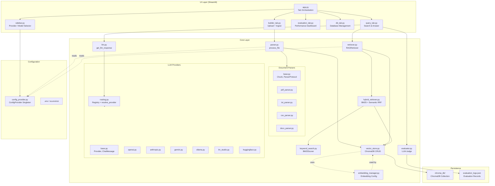
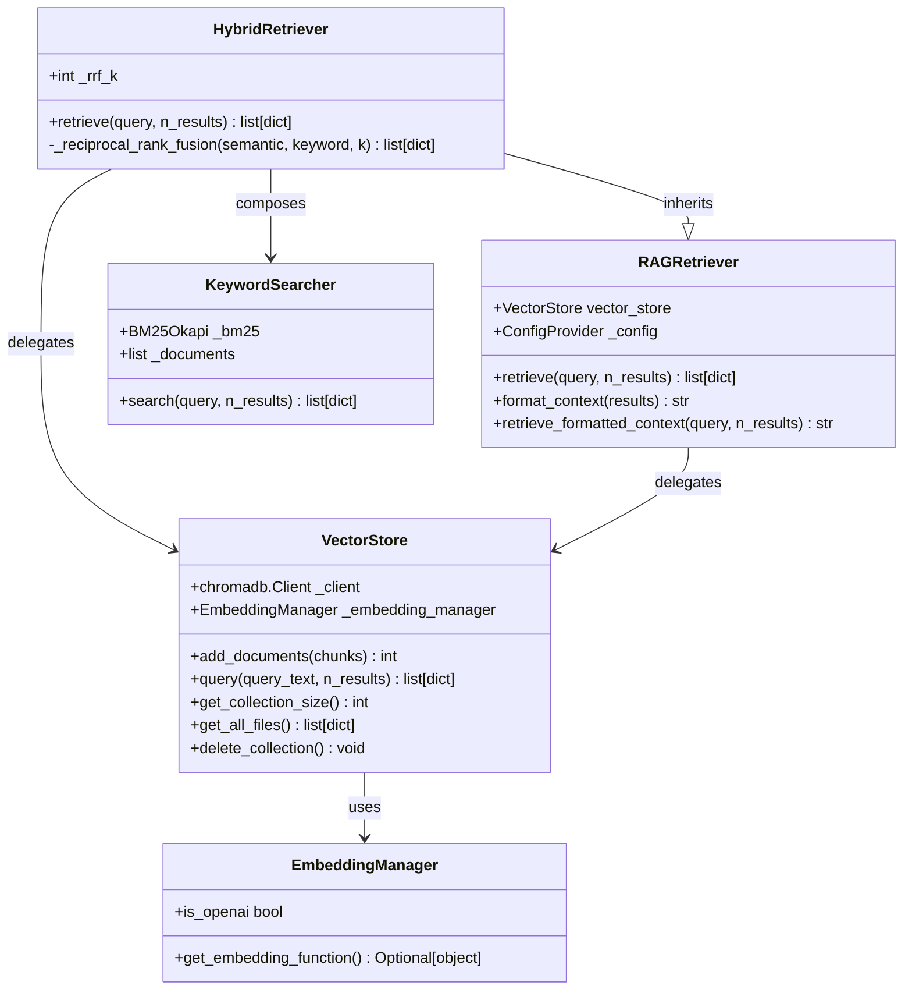
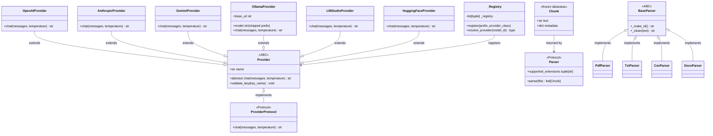
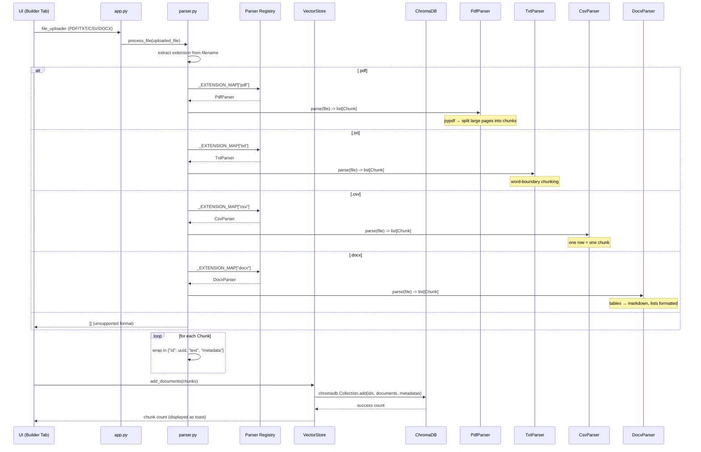
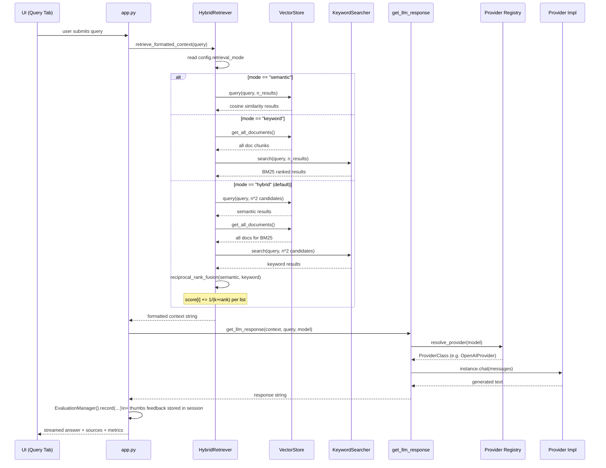
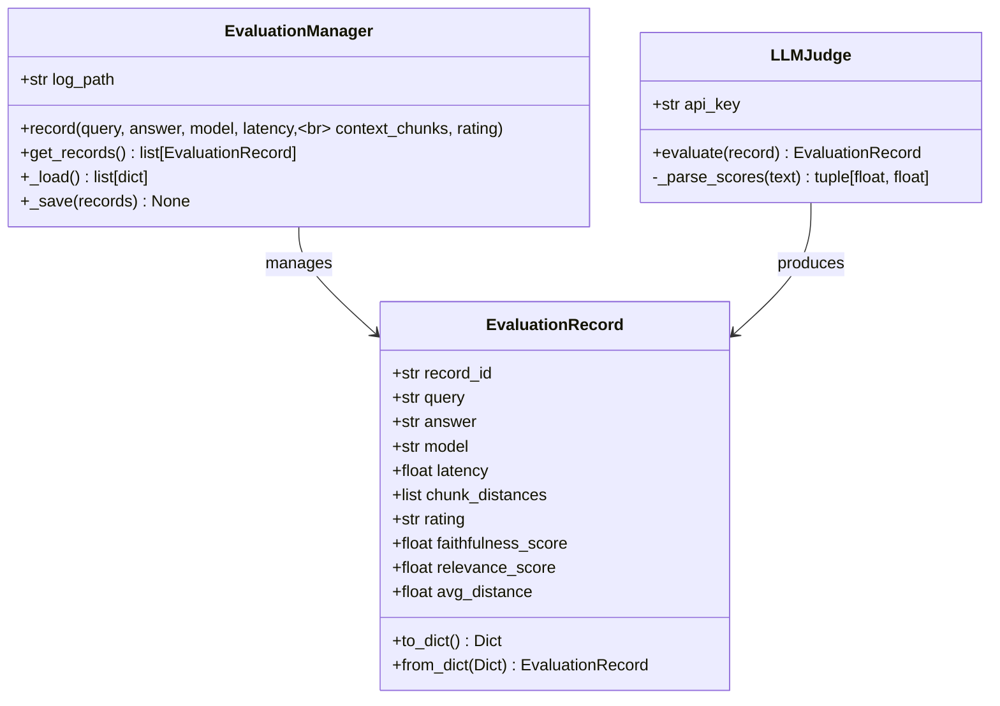

# Architecture Document

## Table of Contents

1. [Overview](#overview)
2. [System Architecture](#system-architecture)
3. [Core Modules](#core-modules)
4. [Ingestion Pipeline](#ingestion-pipeline)
5. [Query & Retrieval Flow](#query--retrieval-flow)
6. [Provider Routing](#provider-routing)
7. [Parser Registry](#parser-registry)
8. [Evaluation Framework](#evaluation-framework)
9. [Configuration & Dependency Injection](#configuration--dependency-injection)

---

## Overview

This is a **Streamlit-based RAG application** that ingests local documents into a ChromaDB vector store and answers queries using pluggable LLM backends. The codebase is organized in four layers:

| Layer | Location | Responsibility |
|---|---|---|
| **UI** | `src/ragapp/ui/` | Streamlit widgets, tab rendering, session state management |
| **Core** | `src/ragapp/core/` | Business logic — parsers, providers, retrievers, vector store |
| **Config** | `src/ragapp/config_provider.py` | Singleton settings + API key getters |
| **Root** | `src/ragapp/app.py` | Streamlit entry point, session-state wiring, tab orchestration |

---

## System Architecture



---

## Core Modules

### Class Hierarchy — Retrieval



### Class Hierarchy — Providers & Parsers



---

## Ingestion Pipeline



### Extension Mapping

The registry is built at import time — zero configuration needed:

```python
# parser.py (module-level, eager init)
_EXTENSION_MAP: dict[str, type] = {}
for _cls in (CsvParser, DocxParser, PdfParser, TxtParser):
    for _ext in _cls.supported_extensions:
        _EXTENSION_MAP[_ext] = _cls
```

---

## Query & Retrieval Flow



### Retrieval Mode Selection

The config value `retrieval_mode` (from `.env`, default `"hybrid"`) controls behavior. In hybrid mode, **Reciprocal Rank Fusion** (RRF) merges the two ranked lists:

```
score(doc_id) = Σ 1 / (k + rank_in_list_i)    for each list containing doc_id
final = sorted(results, key=score, reverse=True)
```

---

## Provider Routing

Model IDs are routed to provider classes via prefix matching in `_Registry`:

```mermaid
graph LR
    M[model ID] --> R{resolve_provider}
    R --> |starts with<br/>"groq:"| G[Groq → OpenAIProvider]
    R --> |starts with<br/>"ollama:"| O[OllamaProvider]
    R --> |starts with<br/>"lmstudio:"<br/>or "lm-studio:"| L[LMStudioProvider]
    R --> |starts with<br/>"hf-"| H[HuggingFaceProvider]
    R --> |starts with<br/>"claude-"| C[AnthropicProvider]
    R --> |starts with "gemini"| E[GeminiProvider]
    R --> |empty prefix match| N[OpenAIProvider (default)]
    R --> |no match| ERR[UnsupportedModelError]
```

**Registration order matters.** The `__init__.py` registers providers in priority order: specific prefixes before the empty default. Groq and OpenAI share the same provider class but differ only in which API key is validated (`GROQ_API_KEY` vs `OPENAI_API_KEY`).

---

## Parser Registry

```mermaid
flowchart TD
    Start[uploaded file] --> Ext{extract extension}
    Ext --> |pdf| PDF[PdfParser]
    Ext --> |txt| TXT[TxtParser]
    Ext --> |csv| CSV[CsvParser]
    Ext --> |docx| DOCX[DocxParser]
    Ext --> |other| Empty[return []]

    PDF --> Chunking[pypdf → split long pages<br/>into chunk_size paragraphs]
    TXT --> Chunking2[word-boundary chunking<br/>with smart merges]
    CSV --> Rows[one row = one chunk<br/>no chunk_size param]
    DOCX --> Blocks[paragraphs, tables → markdown,<br/>bullets/numbers formatted]

    Chunking --> Merge[wrap in Chunk dataclass]
    Chunking2 --> Merge
    Rows --> Merge
    Blocks --> Merge

    Merge --> Done[{list[dict]<br/>id + text + metadata}]
```

---

## Evaluation Framework



Evaluation records are auto-captured on every query (stored in `evaluation_logs.json`). The **Evaluation tab** aggregates metrics — thumbs-up %, avg latency, avg vector distance, and AI-judge faithfulness/relevance scores.

---

## Configuration & Dependency Injection

```mermaid
graph LR
    Env[os.environ / .env] --> Settings[Settings<br/>(Pydantic BaseModel)]
    Settings --> CP[ConfigProvider<br/>(singleton wrapper)]

    CP --> |inject| VS["VectorStore(config_provider)"]
    CP --> |inject| RET["HybridRetriever(config_provider)"]
    CP --> |inject| EMB["EmbeddingManager(config_provider)"]
    CP --> |read-only| LLM["get_llm_response(config_provider)"]

    CP --> KEY1[api_key_getters<br/>openai_key, anthropic_key, ...]
    CP --> CFG["retrieval_mode, n_results,<br/>chunk_size, system_prompt,..."]
```

`ConfigProvider` is the central injection point. All core modules accept it as an optional constructor argument — tests inject fakes; production uses the singleton from `get_config()`.

### Settings Reference

| Key | Default | Used By |
|---|---|---|
| `OPENAI_API_KEY` | _(empty)_ | Embedding, OpenAI provider |
| `ANTHROPIC_API_KEY` | _(empty)_ | Anthropic provider |
| `GOOGLE_API_KEY` | _(empty)_ | Gemini provider |
| `GROQ_API_KEY` | _(empty)_ | Groq variant (uses OpenAIProvider) |
| `HUGGINGFACE_API_KEY` | _(empty)_ | HuggingFace provider |
| `CHROMA_DB_PATH` | `./chroma_db` | VectorStore persistence |
| `COLLECTION_NAME` | `my_rag_collection` | ChromaDB collection identity |
| `DEFAULT_LLM` | `gpt-4o-mini` | Sidebar default model |
| `LLM_TEMPERATURE` | `0.2` | All LLM inference |
| `LLM_MAX_TOKENS` | `1024` | All LLM inference |
| `LLM_SYSTEM_PROMPT` | _(default in code)_ | System message in every prompt |
| `CHUNK_SIZE` | `1000` | Parser word-boundary threshold |
| `N_RESULTS` | `3` | Default vector query count |
| `RETRIEVAL_MODE` | `hybrid` | retriever mode selector |
| `OLLAMA_BASE_URL` | `http://localhost:11434/v1` | OllamaProvider, model discovery |
| `LM_STUDIO_BASE_URL` | `http://localhost:1234/v1` | LMStudioProvider, model discovery |
